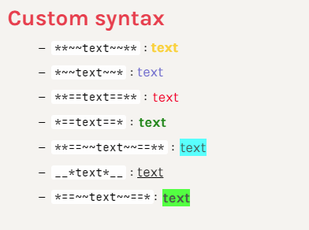
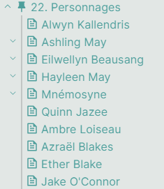
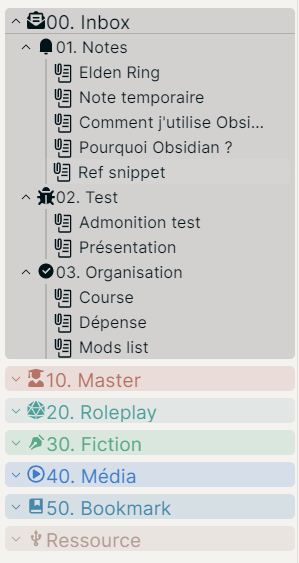

This repo is a collection of CSS snippets for [Obsidian.md](https://obsidian.md/).

> ⚠️ Some snippet won't be updated, adjust them as you want. 

To install them on PC:
- Put the snippets in the `snippets` folder of `.obsidian` in the root of your vault;
- In Obsidian: Appearance → Refresh snippets ⇒ Activate the ones you want.

> :warning: In IOS, it is impossible to access hidden folders. You can:
> - Use Textastic
> - Working Copy with a link to a folder
> - a-shell  

[For more information](https://forum.obsidian.md/t/mobile-ios-app-to-work-with-hidden-folder/25741)

Alternatively, you can use [Obsidian Snippet Downloader](https://github.com/Mara-Li/obsidian-snippet-downloader)

Each snippets can be adjusted with [Style Settings](https://github.com/mgmeyers/obsidian-style-settings/).

# [Custom Syntax](MD%20-%20Custom%20Syntax.css)
This is a simple snippet that allows a specific formatting using markdown syntax, without using HTML.

References :
- `**~~text~~**` : Yellow text
- `*~~text~~*` : Blue text
- `**==text==**` : Red text
- `*==text==*` : Bold green text
- `__*text*__` : Underline
- `**==~~text~~==**` : Cyan Highlight
- `*==~~text~~==*`: Green highlight

# Folder Note

:warning: This snippet is mostly present in terms of EXAMPLE. 

This snippet allows you to turn a folder into a note, by moving the various icons in a folder.
To use it you need :
- [Folder Note](https://github.com/aidenlx/alx-folder-note)
- [Icon Folder](https://github.com/FlorianWoelki/obsidian-icon-folder)

Some themes have snippet exemple to adjust the folder note icons : 
- [Primary](Folder%20Note/Icon%20folder/FNI%20-%20Primary.css)

:warning: You need to change the paths of your files!

# [Colored Folder](Colored%20Folder/F%20-%20Color.css)

<u>Credit</u>: 
- [Lithou](https://forum.obsidian.md/t/adding-color-to-obsidian-a-rainbow-of-possibility/12805/11)
- [Javalent](https://github.com/valentine195/Obsidian-Vault/blob/master/.obsidian/snippets/colors.folders.css)

This snippet allows:
- Add colors for each folder numbered from 00 to 100 
- Add lines for the children files of a folder

# [Image Float](CSS/IMG - Grid float.css)

All of the credit for this snippet to go [Lithou](http://github.com/lithou/sandbox). I just adapted this snippet to work with Live Preview. I pretty didn't know if Lithou updated it.

# [YAML](CSS/YAML.css)

Some tweaks around yaml to make it beautiful in Live Preview. 

